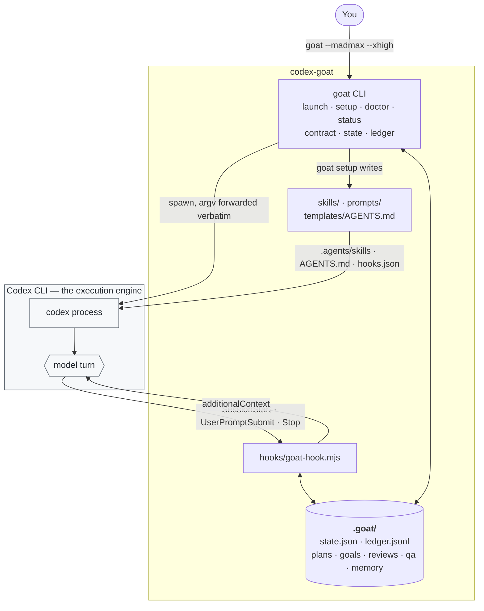
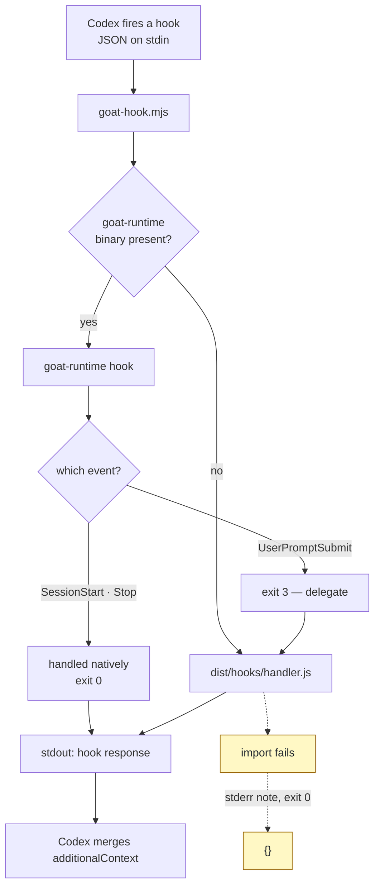
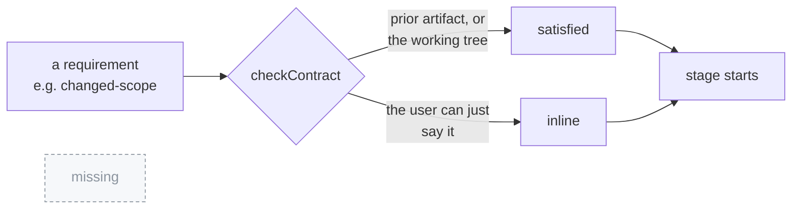
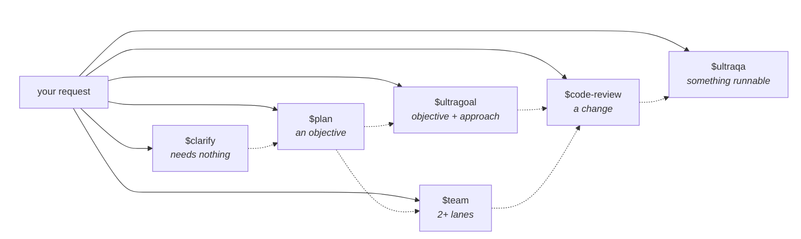
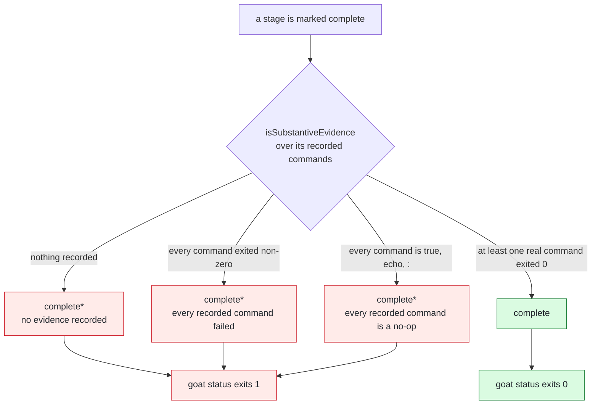
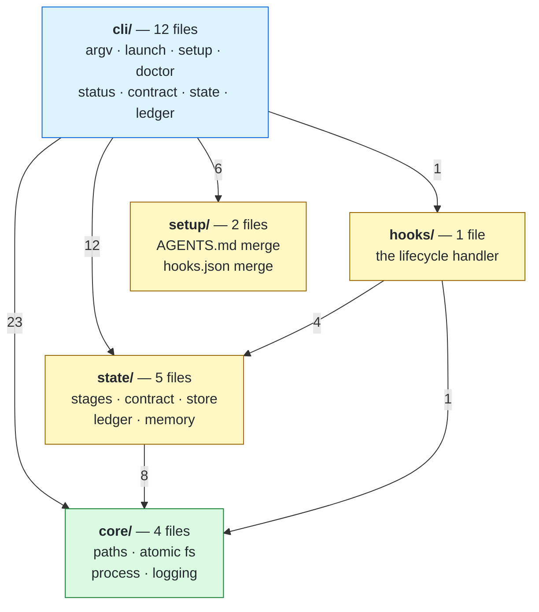
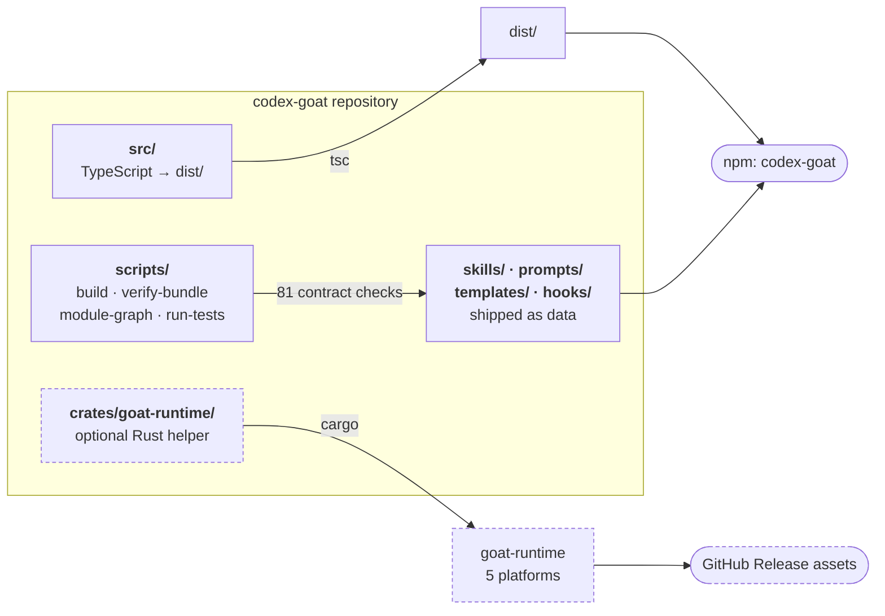
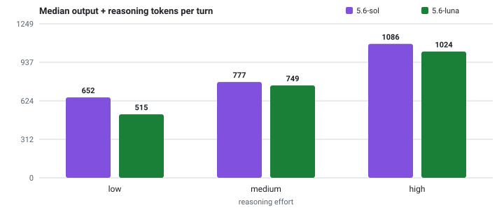
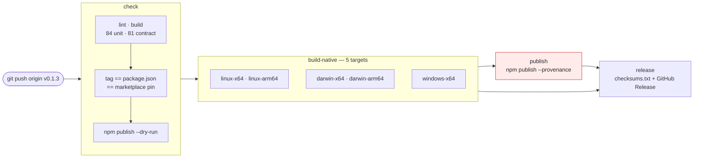

<div align="center">

# codex-goat

**A stronger default for [OpenAI Codex CLI](https://github.com/openai/codex).**

Better prompts, one consistent workflow, and runtime helpers that make "done" auditable. Codex stays the execution engine.

[](https://www.npmjs.com/package/codex-goat) [](./LICENSE) [](https://nodejs.org) [](https://github.com/hypnguyen1209/codex-goat/actions/workflows/ci.yml)

```bash
npm install -g codex-goat
```

</div>

---

codex-goat does not replace Codex, wrap its model calls, or fork its source. It keeps Codex as the execution engine and makes it easier to:

- **start a stronger Codex session by default** — `goat` launches `codex` with raised reasoning effort, optional worktree isolation, and project guidance already loaded
- **run one consistent workflow from clarification to completion** — six stages that share a state directory, an evidence ledger, and one set of operating rules
- **invoke that workflow with `$plan`, `$ultragoal`, `$team`, `$code-review`, and `$ultraqa` — each independently, no fixed chain**
- **keep plans, goals, reviews, and state in `.goat/`**, surviving compaction and restarts

## Install

Requires Node 20+ and a Codex CLI that is already installed and authenticated — codex-goat drives `codex`, it does not replace it.

```bash
codex --version                  # must already work
npm install -g codex-goat

cd your-project
goat setup --scope project
goat doctor
goat exec "Reply with exactly GOAT-OK"
```

`goat doctor` checks the install shape. `goat exec` is the real smoke test — it forces Codex to authenticate and complete a model call. A green doctor with a failing exec means an auth or profile problem, not an install problem.

<details>
<summary><strong>Other ways to install</strong></summary>

Without a global install, `npx` runs the same CLI. `goat setup` still writes to the project, so this is a real install path and not just a preview:

```bash
npx codex-goat setup --scope project
npx codex-goat doctor
```

Upgrade, check, and remove:

```bash
npm install -g codex-goat@latest   # upgrade; re-run `goat setup` to refresh skills and hooks
npm view codex-goat version        # what the registry has
goat uninstall --scope project     # removes skills, AGENTS block, and hooks; keeps .goat/
npm uninstall -g codex-goat
```

The package installs two identical binaries, `goat` and `codex-goat`. Use the second if something else on your `PATH` already answers to `goat`.

Published from CI with [npm provenance](https://docs.npmjs.com/generating-provenance-statements), so the registry can attest which commit and workflow built the tarball you installed:

```bash
npm view codex-goat dist.attestations
```

</details>

Then work normally:

```bash
goat --worktree=feat/checkout --madmax --xhigh
```

Inside the session, invoke whichever stage the work actually needs:

```text
$plan       "design the checkout fix"
$ultragoal  "implement the approved plan with checkpoint evidence"
$code-review
$ultraqa    --tests
```

<details>
<summary><strong>Install as a Codex plugin instead</strong></summary>

The repository is also a valid Codex plugin (`.codex-plugin/plugin.json`), installable through Codex's own plugin system. These are shell commands, not slash commands — Codex's TUI has `/plugins` for browsing, but installing happens on the CLI:

```bash
codex plugin marketplace add https://github.com/hypnguyen1209/codex-goat
codex plugin add codex-goat@codex-goat
```

The marketplace entry resolves to the **npm** package, because that is the only channel that carries built code: `dist/` is generated at publish time and is not committed, so a plugin installed straight from a git checkout would register three hooks that run, exit 0, and inject nothing.

Plugin mode gives you the skills, the role cards, and the lifecycle hooks. It does **not** give you the `goat` CLI, which the skills use for state, contracts, and the evidence ledger — without it, every evidence step in every skill is a no-op. Install both, or use `goat setup` alone.

**Codex must trust a hook before it runs it.** A freshly registered hook is `Untrusted` and is skipped silently; approve it at the next launch prompt or via `/hooks`. Note that `codex exec` has no trust prompt, so hooks stay inert there until trust is granted interactively at least once.

</details>

## Architecture

Codex does the agent work. codex-goat sits on three seams around it — the process it launches, the skills Codex loads, and the lifecycle hooks Codex calls — and keeps durable state in `.goat/`. Nothing here intercepts a model call.



The CLI and the hook are the only two things that run codex-goat code, and they meet only through `.goat/` — which is why a resumed session and `goat status` cannot disagree about what has been proven.

### Hook dispatch

Three events, one entry script, two implementations. The native binary is optional and handles only what it can answer without the stage table; anything else falls back to Node.



`UserPromptSubmit` is always Node's, because evaluating an entry contract needs the stage table — and that has one source of truth, in TypeScript. Duplicating it in Rust is the drift this split exists to avoid.

Three rules hold on every path: never block, never throw, exit 0 with valid JSON. A failure degrades to `{}` **and says why on stderr**, because a hook that silently succeeds while doing nothing is worse than one that fails loudly.

## The idea: entry contracts, not a pipeline

Most workflow layers give you a chain: clarify → plan → execute → review → QA. Real requests almost never start at the beginning. "Review my changes" has no plan. "Test this properly" has no objective. Forcing a chain makes the tool fight the user.

codex-goat replaces the chain with **entry contracts**. Each stage declares what it needs to start, and every requirement can be satisfied three ways: by a previous stage, by the working tree, or by the user simply saying it in the invocation.

| Stage | Needs | Produces |
| --- | --- | --- |
| `$clarify` | nothing | frozen requirements + a recorded objective |
| `$plan` | an objective | plan with testable acceptance criteria |
| `$ultragoal` | an objective + an approach | goal ledger with per-checkpoint evidence |
| `$team` | an objective + 2+ independent lanes | lane assignments and merged evidence |
| `$code-review` | a change | verified findings, most severe first |
| `$ultraqa` | something runnable | scenario matrix and QA report |

Ask the tool where you stand at any moment:

```bash
goat contract              # every stage: what is already satisfied, what to state inline
goat contract ultragoal    # one stage
```

```text
$ultragoal: ready
     objective: satisfied — objective on record: ship the checkout fix
     plan: inline — supply an approved plan inline, or run $plan first
```

`inline` means *the user's own message can satisfy this* — so the stage proceeds. Nothing is ever hard-blocked, and that is enforced by the type: `RequirementVerdict` is `satisfied | inline`, with no third case, and a bundle check fails if the union grows.



There is no third arrow. `missing` is drawn greyed out because it does not exist in the type — v0.1.0 declared it, nothing ever produced it, and that made the readiness check a tautology and the invariant unenforceable. Deleting the case is what turned the rule into something the compiler holds.

So the six stages are six independent entry points, not a chain. The dotted lines below are what each stage *typically* unblocks — suggestions the skills print, never gates:



"Review my changes" enters at `$code-review` with no plan and no objective. "Test this properly" enters at `$ultraqa`. Neither has to manufacture input it does not need.

## Evidence: what makes "done" mean something

Every stage records proof in an append-only ledger:

```bash
goat ledger evidence --stage ultragoal --exit 0 -- npm test
```

`goat status` then reconciles claims against proof and marks anything that does not hold up as `complete*`. Three things fail the check: no evidence at all, a command that exited non-zero, and a shell no-op like `true` that exits 0 without testing anything.

```text
$plan          complete   ready
     artifact: .goat/plans/checkout.md
     last evidence: npm test -> exit 0
$ultragoal     complete*  ready
     unproven: every recorded command failed (last: npm test -> exit 1)

goat warn 1 stage(s) marked complete without evidence that backs the claim (shown as complete*).
```

`goat status` exits non-zero when that happens, so CI can gate on it. This is the single rule that separates finished work from a confident claim about finished work, and every bundled skill enforces it.



The exit-code check is the load-bearing one: v0.1.0 stored `exitCode`, wrote it to the ledger, printed it — and never compared it, so `--exit 1 -- npm test` closed the gate. The no-op list is a lint against lazy proof, not a security control; `bash -c true` defeats it, and the code says so.

## Command surface

```text
goat [flags] [codex args...]           launch Codex with stronger defaults
  --high | --xhigh | --medium | --low  reasoning effort (default: high)
  --effort <level>                     the same, explicit
  --madmax                             codex --dangerously-bypass-approvals-and-sandbox
  --worktree[=<name>] | -w <name>      run inside a dedicated git worktree
  --no-goat-defaults                   forward argv to codex untouched
  --print-argv                         print the resolved codex command and exit
  --                                   everything after this goes to codex verbatim

goat setup [--scope user|project] [--force]
goat doctor
goat exec [--role <name>] "<prompt>"
goat status
goat contract [<stage>] [--json]
goat state read|set|clear
goat ledger read|evidence|note
goat skills [--roles]
goat hook
goat uninstall [--scope ...] [--purge-state]
```

Nothing is hidden. `goat --print-argv` shows the exact command that would run:

```bash
$ goat --madmax --xhigh -m gpt-5 "fix the bug" --print-argv
codex -c 'model_reasoning_effort="xhigh"' --dangerously-bypass-approvals-and-sandbox -m gpt-5 'fix the bug'
```

Flags codex-goat does not own are forwarded to Codex in the order you typed them.

## Role cards

Nine specialist prompts for focused sub-tasks — planner, executor, verifier, reviewer, security-reviewer, test-engineer, architect, critic, researcher. Each states what the role does, what it **refuses**, and the shape of its output.

```bash
goat skills --roles
goat exec --role security-reviewer "Audit the token refresh path in src/auth/"
```

Inside a session they are the `$goat-roles` skill. Adopt one at a time; two role cards at once average into neither.

## Runtime helpers

Three Codex lifecycle hooks, registered by `goat setup`:

| Event | What it does |
| --- | --- |
| `SessionStart` | Injects the active objective, in-flight stages, unproven claims, and a memory digest. Matches all four sources — `startup`, `resume`, `clear`, **`compact`** — so the state is re-injected after a compaction, which is exactly when the model has lost it |
| `UserPromptSubmit` | When a prompt invokes a stage, attaches that stage's entry-contract report |
| `Stop` | Records the turn's outcome into session memory |

Three properties hold for every hook, and are covered by tests in both implementations:

1. **Never blocks.** No hook can return a block decision.
2. **Never throws.** Malformed input exits 0 with `{}`.
3. **Never phones home, and stays cheap.** Local file reads, plus at most one `git status --porcelain` (5s timeout) — and only when a prompt explicitly invokes a stage whose contract depends on the working tree. Ordinary prompts run no subprocess.

**Session memory** is a local, append-only log under `.goat/memory/`. Prose is compressed; code spans, paths, URLs, filenames, and version numbers are preserved byte-for-byte. `<private>…</private>` is stripped before anything reaches disk.

### The native fast path

`crates/goat-runtime` is an optional dependency-free Rust binary that handles `SessionStart` and `Stop` in a few milliseconds instead of paying Node's startup cost.

Every release attaches prebuilt binaries for linux-x64, linux-arm64, darwin-x64, darwin-arm64, and windows-x64, with a `checksums.txt`. Download one from [Releases](https://github.com/hypnguyen1209/codex-goat/releases), then either drop it next to the installed package as `bin/goat-runtime` or point at it:

```bash
export GOAT_RUNTIME_BIN=/path/to/goat-runtime
goat doctor            # the "native runtime" check should now read PASS
```

With a Rust toolchain you can build it yourself instead:

```bash
npm run build:native
```

It is genuinely optional — `hooks/goat-hook.mjs` falls back to the TypeScript handler when the binary is absent, and `UserPromptSubmit` is always delegated to Node because the stage table has one source of truth in TypeScript. The one piece of logic both implementations share, the memory compressor, is pinned by a fixture that [both test suites read](./crates/goat-runtime/tests/fixtures/compress.json), so they cannot drift.

## Project structure

Five layers, strictly one-directional. The graph below is generated from the actual imports by `node scripts/module-graph.mjs`, not drawn from memory — edge labels are how many import statements cross that boundary.



`core` imports nothing above it, `setup` imports nothing at all across layers — it is pure functions over data, which is why both merges are easy to test exhaustively. There are no cycles; the script reports them, so a future one fails visibly rather than quietly.

Two entry points, and only two:

| Entry point | Layer path | Runs when |
| --- | --- | --- |
| `dist/cli/goat.js` | `cli` → everything | you type `goat …` |
| `hooks/goat-hook.mjs` | → `hooks` → `state` → `core` | Codex fires a lifecycle event |

They share no process and communicate only through `.goat/`.



The dashed path is optional: `goat-runtime` is a speed-up for two hooks, and everything works without it. `skills/`, `prompts/`, and `templates/` are **data, not code** — Codex reads them directly, so they get their own contract test rather than type checking.

## Benchmark: what codex-goat costs

The question that matters is what installing this costs you per turn. Measured directly: two identical scratch projects, one clean and one after `goat setup --scope project`, same prompt, same model, hooks trusted. Numbers come from Codex's own `turn.completed` usage event via `codex exec --json` — nothing is estimated.

| Model | Codex alone | + codex-goat | cost | |
| --- | --: | --: | --: | --: |
| `gpt-5.6-sol` | 25,106 | 25,845 | **+739** | +2.9% |
| `gpt-5.6-luna` | 23,550 | 24,286 | **+736** | +3.1% |

**codex-goat adds about 737 tokens to every turn — roughly 3%.** The two models agree to within 3 tokens, which is what you would expect if the cost is the text codex-goat installs rather than anything model-specific. Spread across runs was ±1 to ±25 tokens.

That 737 is the `AGENTS.md` operating-rules block plus the one-line description of each of the eight skills, which Codex keeps in its catalog at all times. Skill *bodies* are not in that number: Codex loads a skill body only when the skill is invoked, and they run 481–1,153 tokens each.

<details>
<summary><strong>What is and is not included</strong></summary>

Measured with a trivial prompt against an empty `.goat/`, so the SessionStart hook had no objective, no in-flight stages and no memory to inject. On a real session it also contributes: a mid-project digest measured **~130 tokens** after deduplication (it was ~512 before the fix in 0.1.3).

So the honest range is **~737 tokens on turn one, up to roughly ~870 mid-session**, against a Codex baseline of 23.5–25.1k. The floor is Codex's own prefix — system instructions, tool schemas, the built-in catalog — and codex-goat is a few percent on top of it.

`codex exec` has no hook-trust prompt, so the "+ codex-goat" arm passes `--dangerously-bypass-hook-trust`. Without it the hooks are inert and the measurement would understate the cost.

</details>

### Effort costs more than anything codex-goat adds

Same harness, 90 samples, 5 tasks × 2 models × 3 efforts × 3 runs, zero errors:



| Effort | `gpt-5.6-sol` | `gpt-5.6-luna` | vs low |
| --- | --: | --: | --: |
| `low` | 652 | 515 | 1.00× |
| `medium` | 777 | 749 | 1.19× |
| `high` | 1,086 | 1,024 | **1.67×** |

The trend is monotonic in all six cells. Moving from `low` to `high` costs sol **+434 output tokens per turn** — more than half the entire install cost of codex-goat, paid again on every single turn.

`goat` injects `model_reasoning_effort` on every launch and defaults to `high`, so this is the flag that actually moves your bill:

```bash
goat --low          # routine edits, lookups, mechanical changes
goat --xhigh        # the default is high; go up only when the work earns it
```

### What this does NOT measure

Whether codex-goat changes *output* length. That needs the same two environments run across the task set, and the run was cut short when the Codex session expired mid-benchmark — so it is absent here rather than reported from partial data.

It also cannot say which model is cheaper on real work. At medium effort the medians differ by ~4%, but per task the direction reverses from −58% to +176% and the same model varies 5–8× run to run on the same prompt. That spread cannot support a winner at n=3.

### Two methodology notes that changed the numbers

**`input_tokens` is summed across every request in a turn, not per turn.** A question the model thinks twice about reports roughly double the prefix, which is why the prefix table uses a prompt trivial enough to finish in one call.

**Without `--ephemeral`, runs inherit session history and memories from each other.** Identical prompts produced 25k / 51k / 94k input, a 3.8× spread. With it, repeated runs land within ~4 tokens.

Both were found by reading raw samples rather than trusting a green run.

### Reproduce it

```bash
node scripts/bench-models.mjs --prefix --runs 3 --project /path/to/clean-project --label baseline
node scripts/bench-models.mjs --prefix --runs 3 --project /path/to/goat-project --label goat --bypass-hook-trust
node scripts/bench-report.mjs
```

Raw samples are in `bench/results-*.json`, one row per call with Codex's usage object verbatim.

## What lives where

```text
.goat/
├── state/state.json     current stage status and recorded evidence
├── ledger.jsonl         append-only record of claims and proof
├── plans/               plans and frozen requirements
├── goals/               goal ledgers and team lane assignments
├── reviews/             review reports
├── qa/                  QA reports and scenario matrices
└── memory/              compressed session observations
```

`goat setup` also writes:

- `<scope>/.agents/skills/` — the eight bundled skills plus the role cards
- `AGENTS.md` — operating rules, merged between `<!-- GOAT:AGENTS:START/END -->` markers so the rest of your file is preserved byte-for-byte
- `.codex/hooks.json` — lifecycle hooks, preserving any entries owned by other tools

`goat uninstall` reverses all three and leaves `.goat/` alone unless you pass `--purge-state`.

## Development

```bash
npm install
npm run build            # TypeScript -> dist/
npm run build:native     # optional Rust helper
npm run build:bun        # optional single-file binary (bun build --compile)

npm test                 # build + 84 unit tests + 81 bundle contract checks
npm run test:native      # 18 Rust tests
npm run verify           # lint + everything above
```

The Bun binary embeds the code but not `skills/`, `prompts/`, `templates/`, or `hooks/`. Commands that read those — `setup`, `doctor`, `skills`, `exec --role` — need `GOAT_HOME=/path/to/codex-goat`. State and workflow commands work without it.

`npm run test:contract` is the check that catches what unit tests cannot: a SKILL.md whose frontmatter Codex would reject, a declared stage with no skill, a role prompt missing from the `$goat-roles` index, or a hook registration pointing at a file the package does not ship.

### Release pipeline

Pushing a `v*` tag runs the whole thing. The ordering is the point: `npm publish` cannot be undone, so it happens only after everything that could still say no has finished.



An earlier version put `publish` before `build-native`. A cross-compile failure would then have left a published npm version with no matching release assets — and npm will not accept a republish of the same version, so there was no way back. CI cross-compiles the four non-host targets on every push to `main`, so a target that stops building fails there rather than mid-release.

```text
codex-goat/
├── src/
│   ├── cli/             argv parsing, launch, and the goat subcommands
│   ├── core/            paths, atomic filesystem writes, process, logging
│   ├── state/           stage table, entry contracts, state store, ledger, memory
│   ├── setup/           AGENTS.md merging, hooks.json merging
│   └── hooks/           the lifecycle hook handler
├── skills/              the eight bundled skills
├── prompts/             the nine role cards (source of truth)
├── templates/           the AGENTS.md guidance block
├── hooks/               plugin hook registrations and the entry script
└── crates/goat-runtime/ optional native helper
```

## Credits

codex-goat follows the shape established by [oh-my-codex](https://github.com/Yeachan-Heo/oh-my-codex) — the canonical stage names and the "keep Codex as the execution engine" framing come from there. It borrows the preserve-code-and-paths compression idea from [cavemem](https://github.com/JuliusBrussee/cavemem), and the cross-harness plugin packaging conventions from [ECC](https://github.com/affaan-m/ECC).

## License

MIT — see [LICENSE](./LICENSE).
